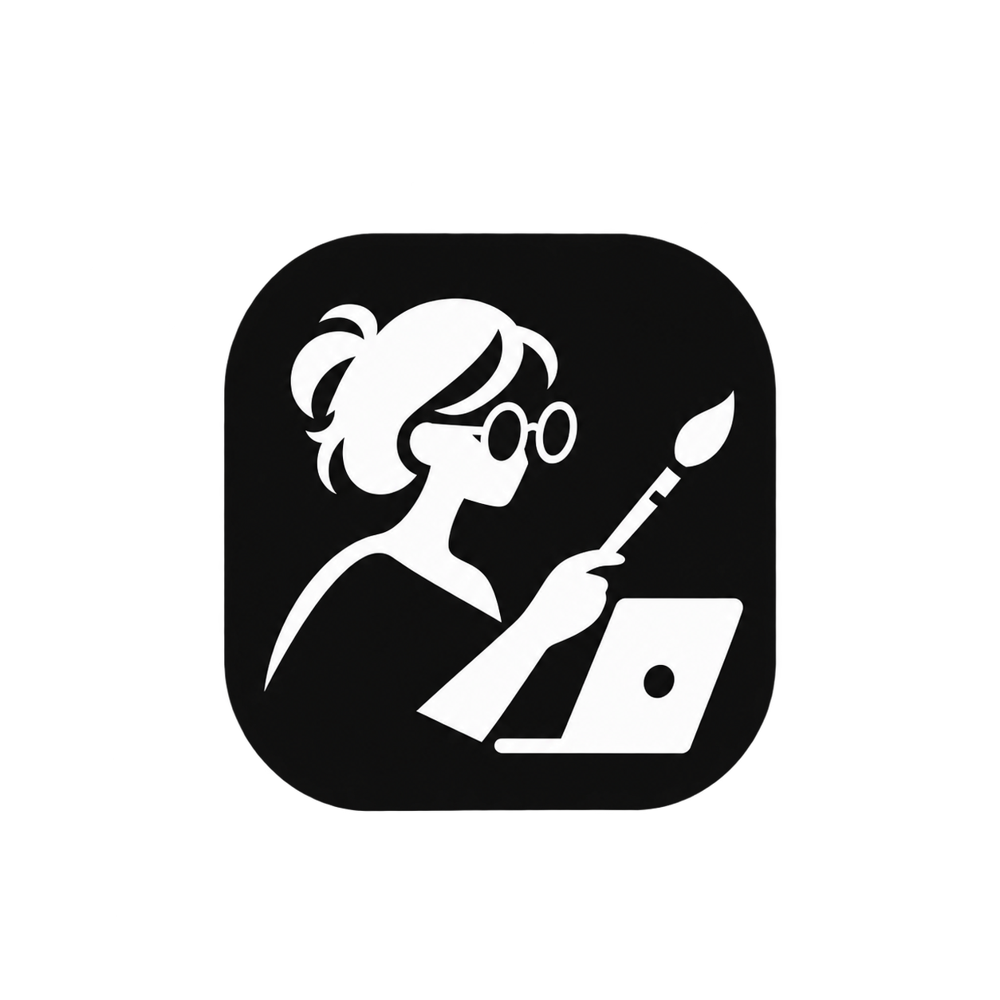

<div align="center">
  
  <h1>ReDepict</h1>
  <p><em>ИИ-помощник для начинающих художников</em></p>
</div>


## 📖 О проекте

**ReDepict** — веб-приложение, которое помогает начинающим художникам 
получать профессиональную обратную связь по своим работам. 

Пользователь загружает фотографию рисунка, а мультимодальная нейросеть 
(OpenAI GPT-4o) в роли художественного критика:
- указывает на конкретные недочёты
- объясняет, что и как можно улучшить
- показывает проблемные зоны прямо на изображении
- отмечает сильные стороны работы

---

## 🎯 Проблема и решение

**Проблема:** начинающим авторам не хватает обратной связи от 
профессионала. Преподаватели дороги, доступны не всегда, а 
самостоятельно оценить свою работу мешает отсутствие опыта.

**Решение:** ИИ-сервис, доступный 24/7 с любого устройства, 
который даёт структурированный, объективный и наглядный разбор 
работы.

---

## 🚀 Функционал

- 📸 **Загрузка рисунка** — через выбор файла или фото
- 🤖 **ИИ-анализ** — структурированный разбор от GPT-4o
- 💬 **Чат с ИИ** — уточняющие вопросы по рисунку
- 📁 **История работ** — сохранение и просмотр прогресса
- 🔐 **Авторизация** — личный кабинет пользователя

---

## 🛠️ Технологический стек

- **Frontend:** React + TypeScript
- **Backend:** Python
- **База данных:** PostgreSQL, SQLAlchemy
- **Хранилище файлов:** MinIO
- **Ключевая технология анализа рисунков:** мультимодальная Vision-LLM через API — OpenAI GPT-4o

## 📦 Установка и запуск

### 1. Клонировать репозиторий

```bash
git clone https://github.com/TimeJerker/ReDepict.git
cd ReDepict